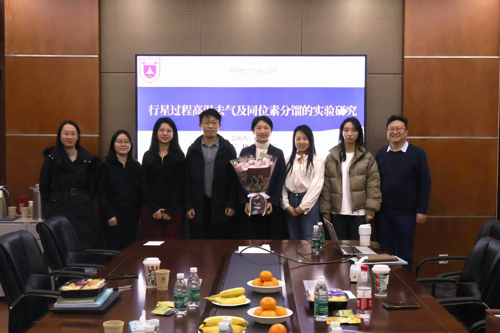
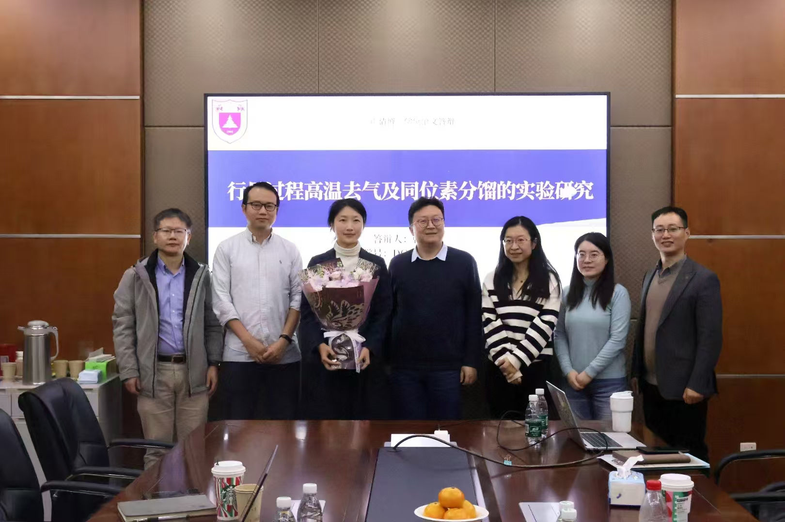

I felt a mix of excitement and relief as I defended my research on *'Experimental Studies of Volatile Degassing and Isotope Fractionation on the Lunar Surface'* under the supervision of Prof. Hejiu Hui. This thesis also greatly benefited from the guidance of Prof. Haolan Tang, Prof. Weiqiang Li, and Dr. Haizhen Wei. I am deeply grateful to my PhD committee for their constructive feedback, and to my friends and family, without whose unwavering support this journey would not have been possible.
