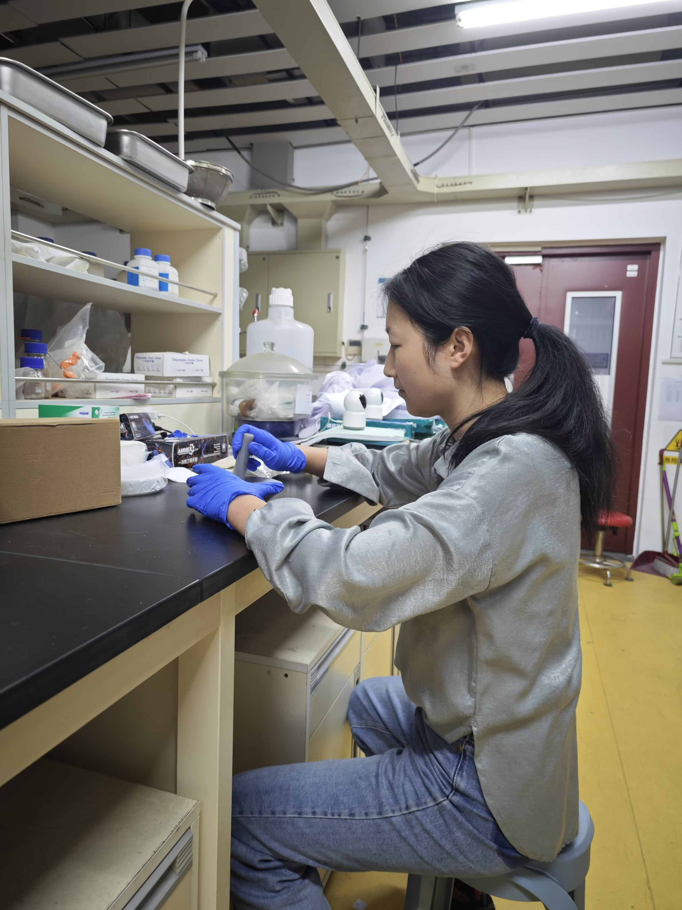
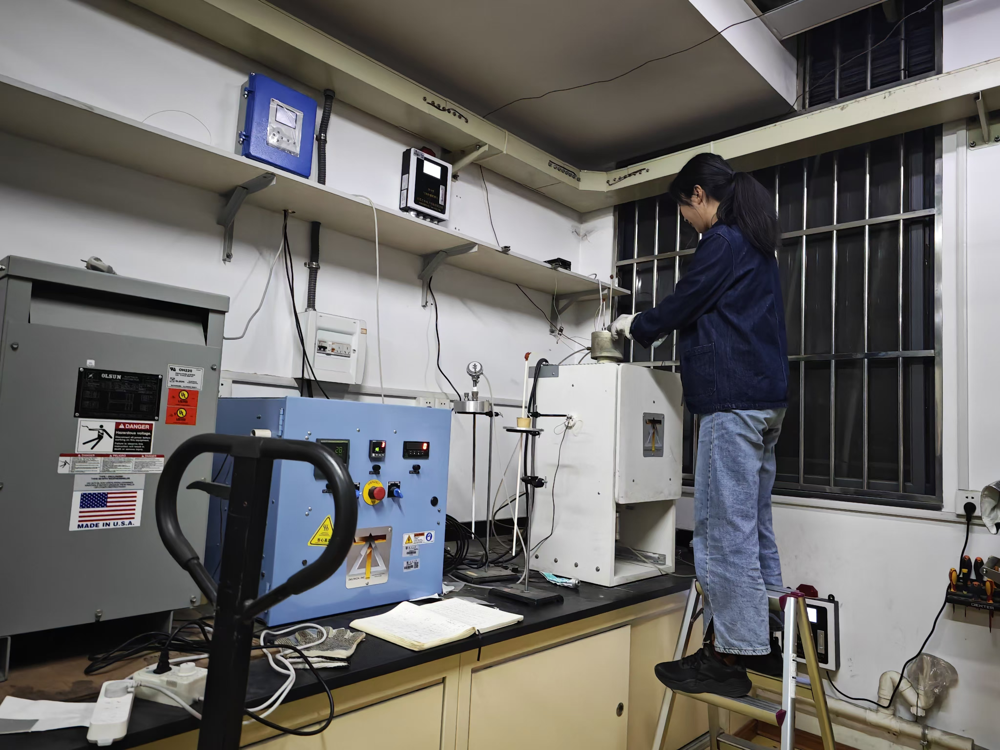

Hi! I am Ziyan ([pronounced](https://www.name-coach.com/ziyan-han-a7df4846-02c4-4590-bd57-5c53d50e2265) like "Tsee-Yen"). I hold a PhD from Nanjing University, advised by Prof. Hejiu Hui. My research centers on experimental petrology and isotopic geochemistry, particularly the volatile evolution of the Moon and other airless bodies.

I am seeking postdoc opportunities!

My research interests mostly focus on:
* Origin and evolution of rocky planets;   
* Evaporation process in nebular and planetary process;   
* Formation of chondrules and CAI;   
* Intersection between high temperature experiments and isotopes in planetary science
{height=300px}
 

When I'm not doing science, I enjoy hiking and birdwatching. You can check out some of the photos I've taken in the [Gallery](https://cyanhan.github.io/ZiyanHan/portfolio/). Feel free to join me for birding or nature observation if you spot me at a conference!

