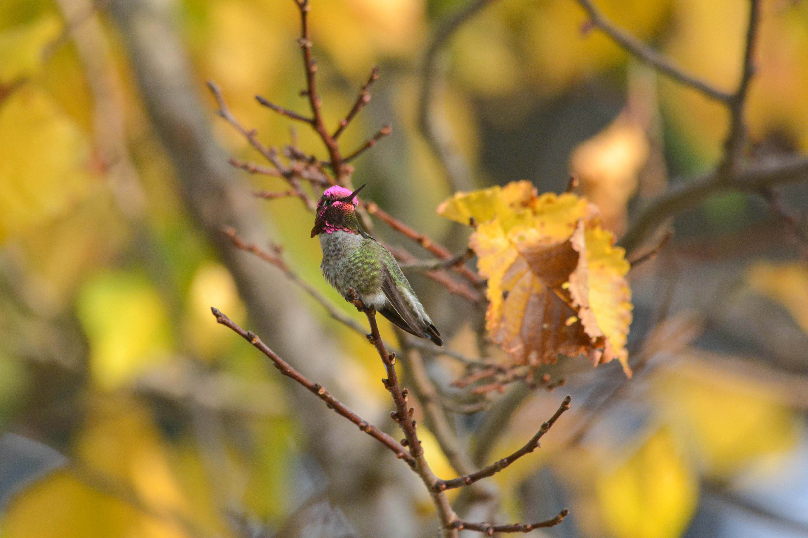

During my stay in San Francisco for AGU 2023, I took the opportunity to explore the local birdlife. As my first visit to America, I was captivated by the incredible diversity of creatures on this new continent. Here are some photos I’d love to share.

Western Bluebird

