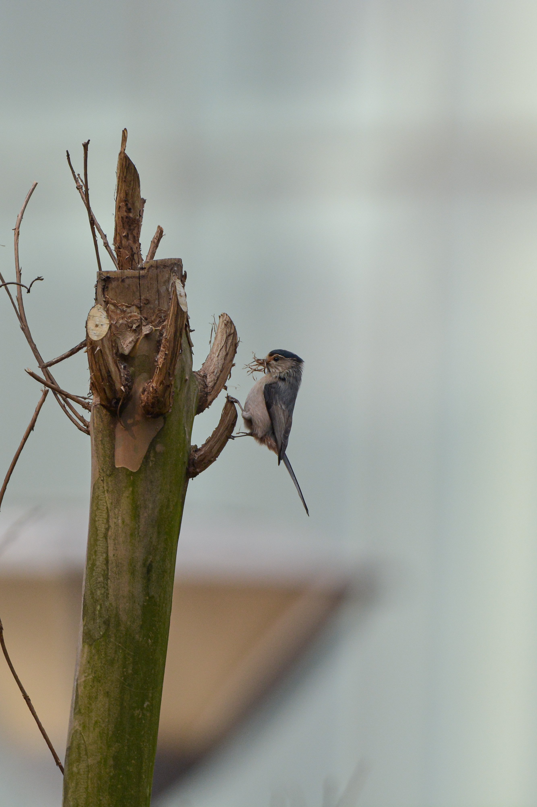
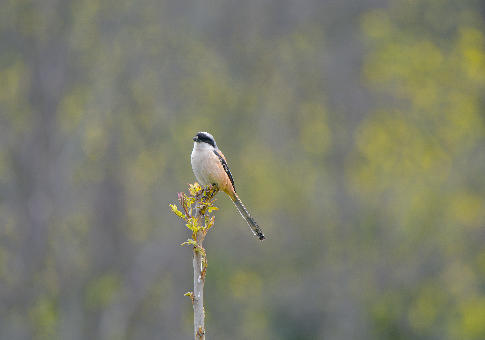
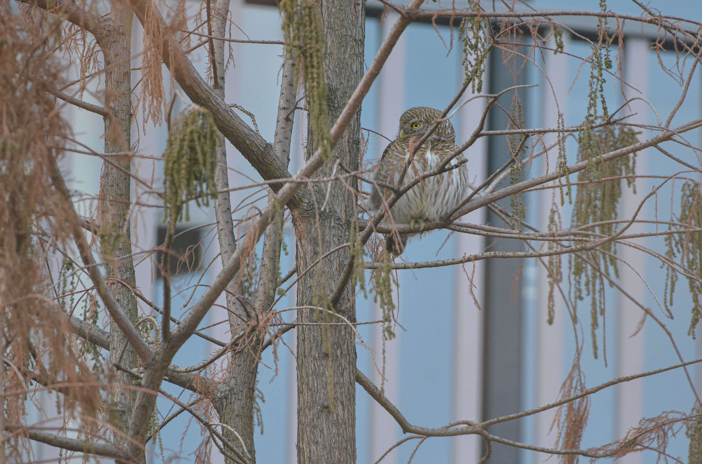
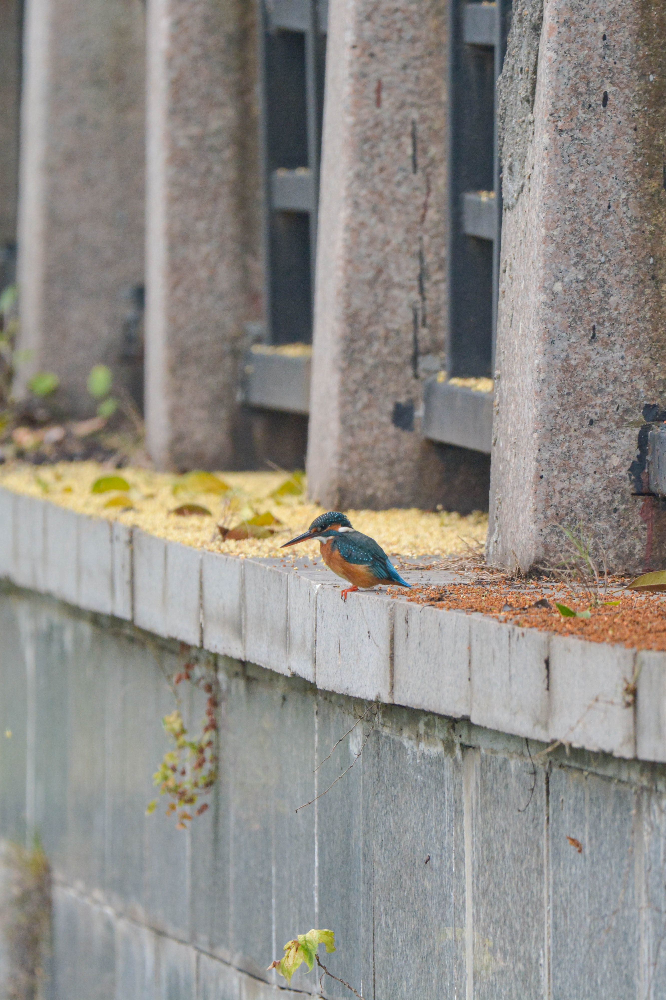
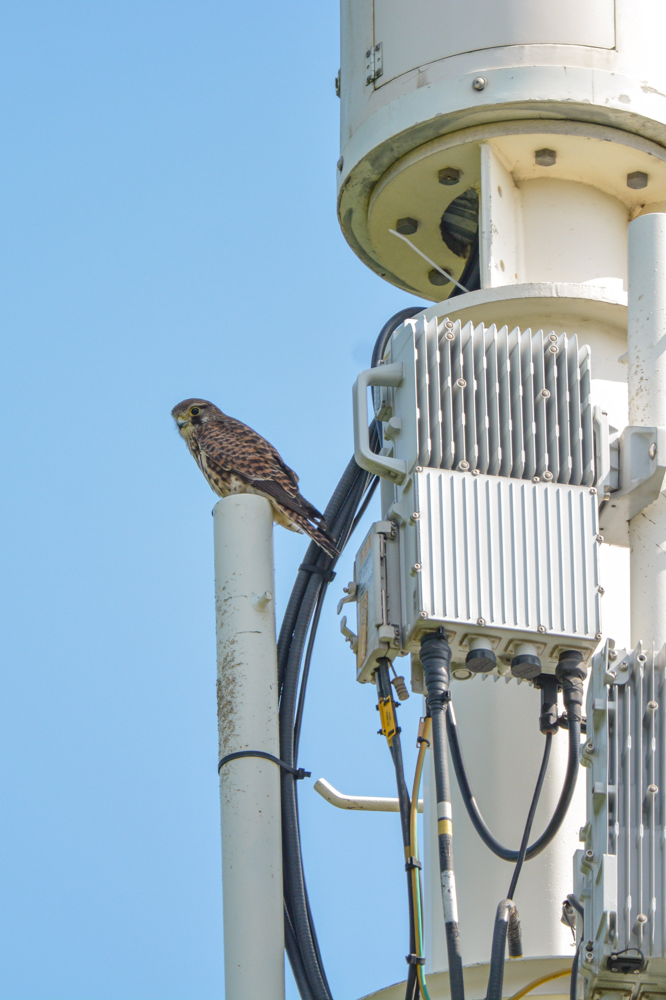
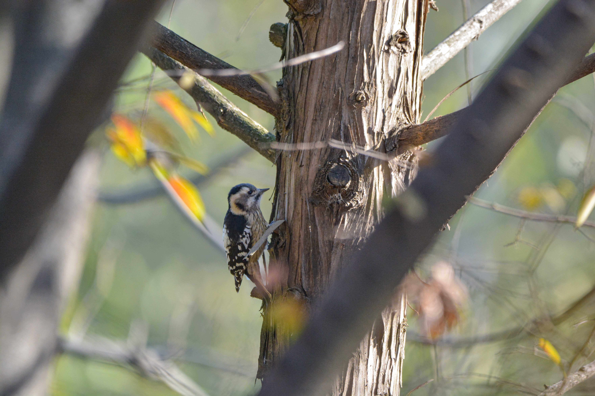

I started birdwatching on Nanjing University’s Xianlin campus during the 2022 lockdown. While I love spotting birds in different parts of Nanjing and beyond, I find just as much joy in observing the ones nearby—following their migrations and daily lives.

During my time on campus, I discovered two bird species that were newly recorded in Nanjing. I also compiled a [checklist](https://docs.qq.com/sheet/DVkJEekF0TGZSQ2xs?tab=BB08J2) of birds found at NJU, which is now managed by the university’s Nature Society.

I made the 2023 [Annual Report on NJU Birds](https://mp.weixin.qq.com/s/t_BM6Cz-xqwq2nKqQLT4yA) (in Chinese), where you can see the 10 most common species on campus and the newly recorded ones from last year.

I’d love to share some of my photos of the birds in NJU with you. 

A Silver-throated Bushtit collecting materials for nesting

A Long-tailed Shrike in front of​ blooming ​rapeseed flowers

An adorable Asian Barred Owlet

A Common Kingfisher with sweet-scented osmanthus

This Common Kestrel perched​ near a building daily ​for a month.

A Grey-capped Pygmy Woodpecker

